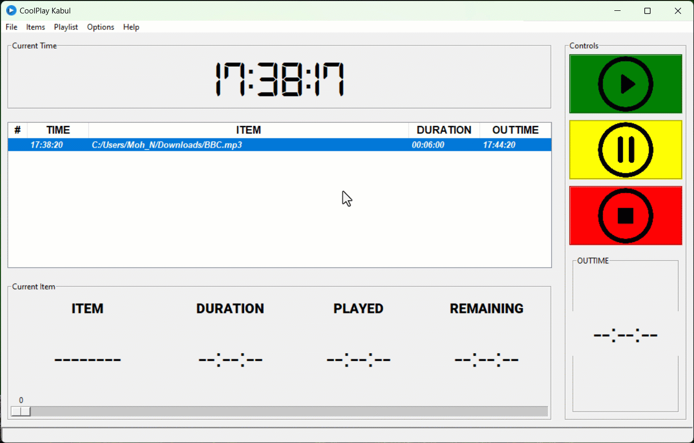

# CoolPlay Kabul

<h2>Introduction</h2>
    
Welcome to CoolPlay Kabul, your versatile music player application designed to cater to your music scheduling needs with ease and efficiency. Whether you're organizing events, studying, or simply enjoying your favorite tunes, CoolPlay Kabul offers an intuitive interface to manage your music schedule and play your favorite tracks hassle-free.

<h2>Interface Overview</h2>

Upon launching the application, you'll be greeted with the main window. Here's what you'll find:

<ul>
<li><strong>Schedule Table:</strong> This table displays your music schedule, including playtimes and associated music items.</li>
<li><strong>Control Buttons:</strong> Control buttons allow you to play, pause, and stop music playback.</li>
<li><strong>Clock Widget:</strong> The clock widget shows the current time, keeping you informed while managing your music schedule.</li>
</ul>
<h2>Managing Your Music Schedule</h2>
    
CoolPlay Kabul simplifies the process of managing your music schedule. Here's how you can utilize the schedule table effectively:

    <h3>Adding Time Entries:</h3>
    <ol>
        <li>Click on the "File" menu and select "New Time".</li>
        <li>Enter the desired time (in the format HH:MM:SS) for playing the music.</li>
        <li>Click "OK" to add the time to the schedule.</li>
    </ol>
    <h3>Adding Music Items:</h3>
    <ol>
        <li>Select a time entry in the schedule table.</li>
        <li>Click on the "Items" menu and choose "New Item".</li>
        <li>Browse your computer to select the music file you want to add.</li>
        <li>The file will be associated with the selected time slot in the schedule.</li>
    </ol>
    <h3>Deleting Time or Items:</h3>
    
To remove a time entry or music item, simply select it in the schedule table. Then, click on the "File" or "Items" menu, and select "Delete Time" or "Delete Item", respectively.

<h2>Playing Music</h2>

CoolPlay Kabul offers seamless music playback, whether manual or automated:

<h3>Manual Play:</h3>
<ol>
    <li>Select a time entry in the schedule table.</li>
    <li>Click the "Play" button in the control panel.</li>
    <li>The selected music item will start playing.</li>
</ol>
<h3>Automated Play:</h3>

Add your desired playtimes and music items to the schedule. CoolPlay Kabul will automatically play the music items at their specified times.

<h2>Additional Features</h2>
    
Enhance your experience with these additional features:

    <ul>
        <li><strong>Pause and Stop:</strong> While the pause function is not currently supported, you can stop music playback at any time using the corresponding buttons in the control panel.</li>
        <li><strong>Status Bar:</strong> The status bar at the bottom of the window provides real-time feedback on the application's status, including notifications and error messages.</li>
    </ul>
<h2>Troubleshooting</h2>
    
If you encounter any issues while using CoolPlay Kabul, try the following troubleshooting steps:

    <ol>
        <li><strong>Supported Music Formats:</strong> Make sure that your music files are in a supported format (mp3 & wav) and accessible from the specified file paths.</li>
        <li><strong>Error Messages:</strong> If you encounter any errors or unexpected behavior, refer to the console output for error messages and contact the developer to fix the bug.</li>
    </ol>

<h2> Get CoolPlay Kabul from GUMROAD </h2>
<a href="https://naimelham.gumroad.com/l/gztkt">GET THIS PRODUCT</a>

Trial version is included in this repository. The trial version closes automatically if you add files that are longer than 30 seconds

